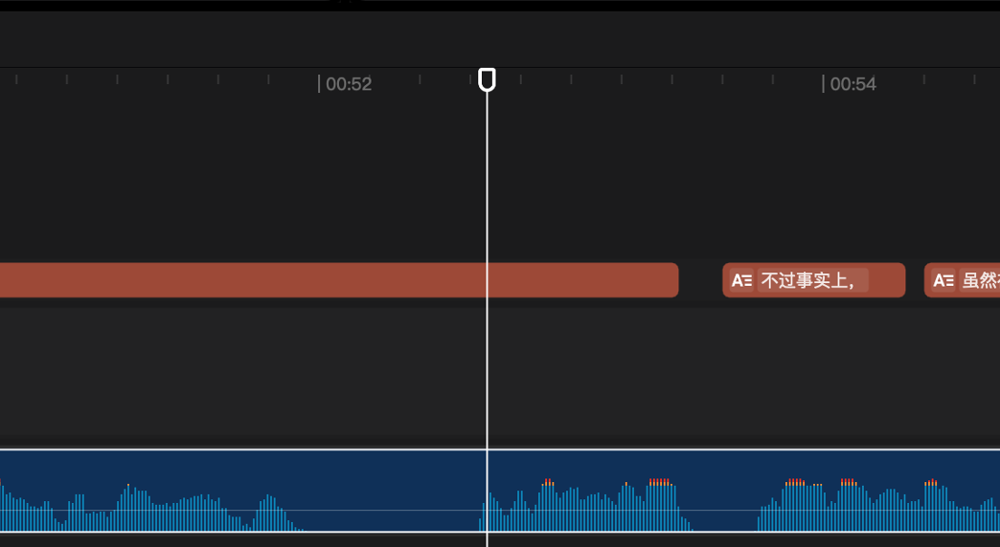
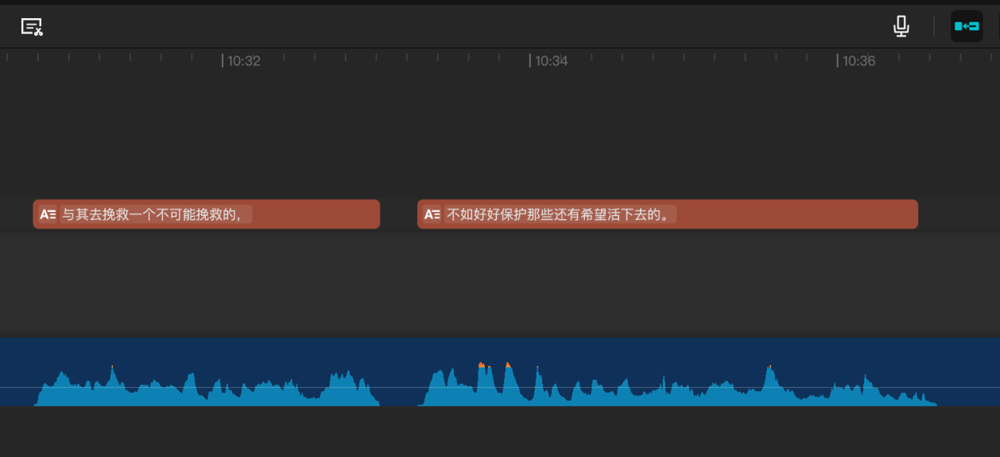
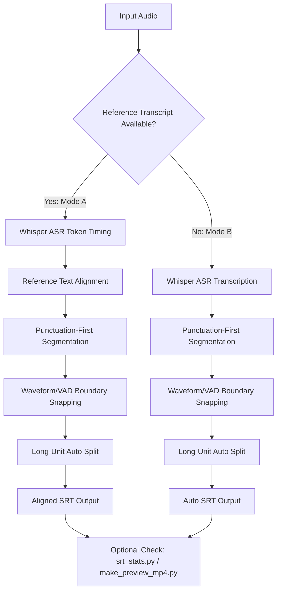

# audio_srt_process

[English](README.md) | [简体中文](README.zh-CN.md)

Dual-mode subtitle generation and alignment for audio content.

Workflows:
- Mode A (highlight): audio + reference transcript -> aligned `.srt`
- Mode B: audio only -> auto subtitle `.srt`

Core differentiator: transcript-aware alignment with waveform/VAD boundary snapping for more stable timing than plain ASR-only pipelines.

## Why This Project

Plain ASR subtitles often need heavy manual timing fixes, especially when you already have a cleaned script.

This tool focuses on:
- token-level timing from ASR
- reference-text alignment to keep final subtitle text consistent with your script
- waveform/VAD boundary snapping to reduce early starts and late ends

## Comparison

ASR-only result (timing drift/misalignment is more visible):



Reference-aligned + waveform-snapped result:



## Features

- Transcript alignment: audio + text -> `.srt`
- Auto subtitle mode: audio only -> `.srt`
- Punctuation-first segmentation for natural subtitle units
- Unique-token anchors + segmented matcher for robust alignment
- Waveform/VAD snapping for boundary refinement
- Timing-aware long-unit auto split
- Output text post-processing: remove commas/periods only for Chinese output (`zh`), keep other punctuation
- Desktop GUI (`tkinter`) and Python CLI/API usage

## Use As Agent Skill

This repository includes a reusable Agent Skill:

- `skills/audio-srt-workflow`

### Codex

Install from GitHub with the built-in installer:

```text
$skill-installer install https://github.com/Sariel2018/audio-srt-aligner/tree/skill-only/plugins/audio-srt-skills/skills/audio-srt-workflow
```

This URL targets the lightweight `skill-only` branch.

Restart Codex after installation.

### Claude Code

This repository also includes `.claude-plugin/marketplace.json` for plugin-based distribution:

```text
/plugin marketplace add Sariel2018/audio-srt-aligner
/plugin install audio-srt-skills@audio-srt-marketplace
```

The marketplace points to the lightweight plugin directory (`skill-only/plugins/audio-srt-skills`) so plugin payloads do not include large sample assets.

Then ask Claude Code to use `audio-srt-workflow` for subtitle tasks.

### OpenClaw

Install as a local shared skill:

```bash
mkdir -p ~/.openclaw/skills
cp -R skills/audio-srt-workflow ~/.openclaw/skills/
```

Or publish to ClawHub and install by slug:

```bash
clawhub install <your-skill-slug>
```

## Pipeline Diagram (Dual Mode)



This diagram maps the two supported pipelines to the same post-processing and quality-check steps.

## Release And Platform Status

- Source code workflow: cross-platform (macOS / Windows / Linux) with Python + `ffmpeg`.
- Current packaged GUI release: primarily macOS (`.app`).
- Windows: source workflow is supported now; packaged Windows binary will be published in a later release.
- If you only need automation/integration, use CLI/API directly from source.

## Installation

```bash
python3 -m venv .venv
source .venv/bin/activate
pip install -r requirements.txt
```

Requirements:
- `ffmpeg` must be available in `PATH`
- first run downloads the selected Whisper model automatically

## Usage

### Method A: With Transcript (Audio + Text, CLI)

Use this when you already have a script/transcript and want stable timing with your exact text.

```bash
python3 align_to_srt.py \
  --audio input.wav \
  --text transcript.txt \
  --output output.srt \
  --model small \
  --language zh
```

### Method B: Without Transcript (Audio Only)

#### Option 1: GUI (recommended for quick use)

```bash
python3 gui_app.py
```

In GUI, open the `Auto Subtitle (Audio)` tab, select audio/output, then run.

#### Option 2: Python API (headless/scriptable)

```python
from argparse import Namespace
from pathlib import Path

from align_to_srt import (
    build_alignment_config,
    resolve_output_path,
    run_auto_subtitle_pipeline,
)

args = Namespace(
    model="small",
    device="auto",
    compute_type="int8",
    language="zh",
    beam_size=5,
    start_lag=0.03,
    end_hold=0.12,
    min_gap=0.03,
    snap_window=0.30,
    no_waveform_snap=False,
    max_unit_duration=5.80,
    split_pause_gap=0.55,
    max_split_depth=2,
    max_early_lead=0.04,
    anchor_min_voice=0.28,
    onset_lookahead=1.20,
    tail_end_guard=0.08,
)

config = build_alignment_config(args)
audio_path = Path("input.wav").resolve()
output_path = resolve_output_path(
    audio_path=audio_path,
    output_arg="output_auto.srt",
    with_date_suffix=False,
)
result = run_auto_subtitle_pipeline(
    audio_path=audio_path,
    output_path=output_path,
    config=config,
)
print(result.output_path)
```

## CLI Parameters (Method A)

`align_to_srt.py` currently exposes transcript-alignment CLI options:

| Option | Default | Description |
|---|---:|---|
| `--audio` | required | Input audio path (`wav/mp3/m4a/...`) |
| `--text` | required | Reference transcript text file |
| `--output` | `<audio_stem>.srt` | Output `.srt` path |
| `--model` | `small` | Whisper model (`tiny/base/small/medium/large-v3/...`) |
| `--device` | `auto` | `auto`, `cpu`, or `cuda` |
| `--compute-type` | `int8` | Runtime precision (`int8`, `float16`, etc.) |
| `--language` | auto | Language code (`zh`, `en`, ...) |
| `--beam-size` | `5` | Beam search size |
| `--start-lag` | `0.03` | Delay subtitle start after detected onset (s) |
| `--end-hold` | `0.12` | Keep subtitle slightly after detected offset (s) |
| `--min-gap` | `0.03` | Minimum gap between adjacent subtitles (s) |
| `--snap-window` | `0.30` | Max waveform snapping distance (s) |
| `--no-waveform-snap` | off | Disable waveform snapping |
| `--max-unit-duration` | `5.80` | Auto-split units longer than this (s) |
| `--split-pause-gap` | `0.55` | Auto-split when internal pause exceeds this (s) |
| `--max-split-depth` | `2` | Max recursive split depth |
| `--max-early-lead` | `0.04` | Max allowed early lead before effective onset (s) |
| `--anchor-min-voice` | `0.28` | Min voice-interval duration for onset anchors (s) |
| `--onset-lookahead` | `1.20` | Early-lead clamp lookahead window (s) |
| `--tail-end-guard` | `0.08` | Tail guard when start falls near interval end (s) |
| `--date-suffix` | off | Append `YYYYMMDD` to output filename |

## Quality Check

Run subtitle timing statistics:

```bash
python3 srt_stats.py --srt output.srt
```

Optional thresholds:

```bash
python3 srt_stats.py --srt output.srt --warn-duration 8 --warn-gap 0.8
```

## Preview Video (Burned Subtitles)

Generate a preview mp4 for manual review:

```bash
python3 make_preview_mp4.py \
  --audio input.wav \
  --srt output.srt \
  --output preview_check.mp4
```

## Project Structure

- `align_to_srt.py`: core alignment and subtitle generation
- `gui_app.py`: desktop GUI entrypoint
- `srt_stats.py`: SRT timing diagnostics
- `make_preview_mp4.py`: quick preview video generation
- `skills/audio-srt-workflow/`: reusable Agent Skill package
- `skill-only/`: lightweight distribution pack for skill/plugin installation
- `.claude-plugin/marketplace.json`: Claude Code marketplace manifest
- `docs/images/`: README images

## License

[MIT](LICENSE)
