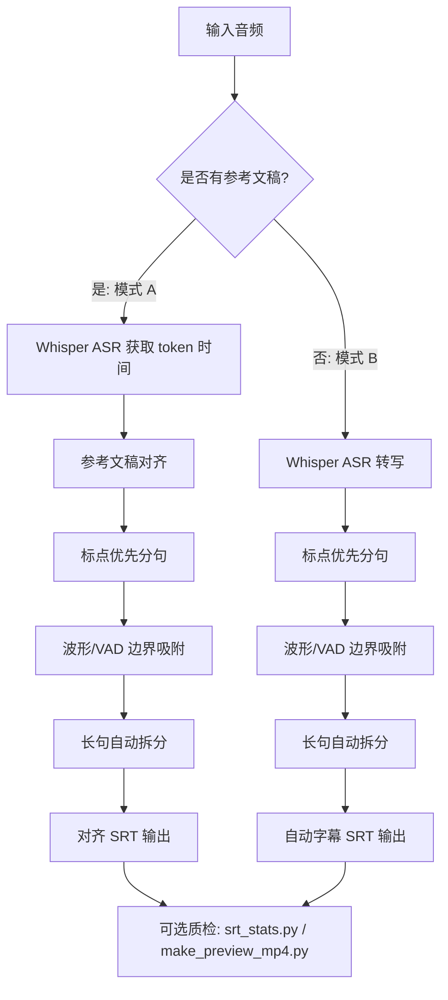

# audio_srt_process

[English](README.md) | [简体中文](README.zh-CN.md)

一个双模式的音频字幕生成与对齐工具。

工作流：
- 模式 A（主打）：音频 + 参考稿 -> 对齐 `.srt`
- 模式 B：仅音频 -> 自动字幕 `.srt`

核心差异点：文稿感知对齐 + 波形/VAD 边界修正，相比纯 ASR 时间轴更稳。

## 为什么做这个项目

纯 ASR 输出通常还要大量手工改时间轴，尤其在你已经有较干净文稿时，常见问题是：
- 字幕内容和稿件不一致
- 起止时间错位
- 长句切分不自然

这个项目的目标是把流程变成：
- 先获取 token 级时间
- 再把参考稿对齐到这些时间
- 最后结合波形/VAD 修正边界，减少提前显示和拖尾

## 效果对比

传统纯 ASR（更容易错位）：


参考稿对齐 + 波形修正：


## 功能特性

- 文稿对齐：音频 + 文本 -> `.srt`
- 自动字幕：仅音频 -> `.srt`
- 标点优先分句，减少生硬切分
- 唯一 token 锚点 + 分段匹配，增强对齐稳定性
- 波形/VAD 边界吸附，优化起止点
- 时长/停顿感知的长句自动拆分
- 输出文本后处理：仅在中文输出（`zh`）时删除逗号和句号（`, . ， 。`），保留其他标点
- 同时支持 GUI（`tkinter`）与 CLI/API

## 作为 Agent Skill 使用

本仓库已内置可复用 Skill：

- `skills/audio-srt-workflow`

### Codex

可通过内置安装器从 GitHub 直接安装：
推荐轻量分支 URL：

```text
$skill-installer install https://github.com/Sariel2018/audio-srt-aligner/tree/skill-only/plugins/audio-srt-skills/skills/audio-srt-workflow
```

`main` 分支路径也可安装：

```text
$skill-installer install https://github.com/Sariel2018/audio-srt-aligner/tree/main/skill-only/plugins/audio-srt-skills/skills/audio-srt-workflow
```

安装后重启 Codex 生效。

### Claude Code

仓库内已提供基于插件市场的分发清单 `.claude-plugin/marketplace.json`：

```text
/plugin marketplace add Sariel2018/audio-srt-aligner
/plugin install audio-srt-skills@audio-srt-marketplace
```

该 marketplace 指向轻量目录 `skill-only/plugins/audio-srt-skills`，安装插件时不会把仓库里的大样例文件带入插件载荷。

安装后可在任务中直接要求 Claude Code 使用 `audio-srt-workflow`。

### OpenClaw

可作为本地共享 Skill 安装：

```bash
mkdir -p ~/.openclaw/skills
cp -R skills/audio-srt-workflow ~/.openclaw/skills/
```

也可以发布到 ClawHub 后按 slug 安装：

```bash
clawhub install <your-skill-slug>
```

### 当前验证快照（2026-03-31）

- 上面两条 Codex 安装 URL 均已实测通过。
- 安装得到的 skill 载荷仅包含：`SKILL.md`、`agents/openai.yaml`、`references/command-templates.md`。
- 已执行一轮端到端 smoke 测试（模式 A）：
  - 音频：`sample/` 目录中的一个样例音频
  - 文稿：对应的样例文本稿
  - 输出：`sample/skill_smoke_20260331.srt`
- 测试结果：对齐 token `3036/3307 (91.8%)`，SRT 条目 `211`。

## 双用法流程图（Pipeline Diagram）



这张图把两条主流程和共用的后处理/质检步骤放在同一个视图里，便于快速理解。

## Release 与平台状态

- 源码工作流：跨平台可用（macOS / Windows / Linux），依赖 Python + `ffmpeg`。
- 当前打包 GUI Release：以 macOS（`.app`）为主。
- Windows：现阶段支持源码运行，独立打包版将在后续 Release 提供。
- 如果你是做自动化或二次集成，建议直接使用 CLI/API。

## 安装

```bash
python3 -m venv .venv
source .venv/bin/activate
pip install -r requirements.txt
```

依赖要求：
- 本机可用 `ffmpeg`（在 `PATH` 中）
- 首次运行会自动下载所选 Whisper 模型

## 使用方法

### 方法 A：有文稿（音频 + 文本，CLI）

适合已经有旁白稿/台词稿，希望输出文本和稿件一致且时间轴更稳的场景。

```bash
python3 align_to_srt.py \
  --audio input.wav \
  --text transcript.txt \
  --output output.srt \
  --model small \
  --language zh
```

### 方法 B：无文稿（仅音频）

#### 方式 1：GUI（推荐）

```bash
python3 gui_app.py
```

在 GUI 里切到 `自动字幕（音频）` 标签页，选择音频和输出路径后运行。

#### 方式 2：Python API（适合批处理/脚本化）

```python
from argparse import Namespace
from pathlib import Path

from align_to_srt import (
    build_alignment_config,
    resolve_output_path,
    run_auto_subtitle_pipeline,
)

args = Namespace(
    model="small",
    device="auto",
    compute_type="int8",
    language="zh",
    beam_size=5,
    start_lag=0.03,
    end_hold=0.12,
    min_gap=0.03,
    snap_window=0.30,
    no_waveform_snap=False,
    max_unit_duration=5.80,
    split_pause_gap=0.55,
    max_split_depth=2,
    max_early_lead=0.04,
    anchor_min_voice=0.28,
    onset_lookahead=1.20,
    tail_end_guard=0.08,
)

config = build_alignment_config(args)
audio_path = Path("input.wav").resolve()
output_path = resolve_output_path(
    audio_path=audio_path,
    output_arg="output_auto.srt",
    with_date_suffix=False,
)
result = run_auto_subtitle_pipeline(
    audio_path=audio_path,
    output_path=output_path,
    config=config,
)
print(result.output_path)
```

## CLI 参数说明（方法 A）

当前 `align_to_srt.py` 的 CLI 面向“有文稿对齐”模式：

| 参数 | 默认值 | 说明 |
|---|---:|---|
| `--audio` | 必填 | 输入音频路径（`wav/mp3/m4a/...`） |
| `--text` | 必填 | 参考文稿文本文件 |
| `--output` | `<audio_stem>.srt` | 输出 `.srt` 路径 |
| `--model` | `small` | Whisper 模型（`tiny/base/small/medium/large-v3/...`） |
| `--device` | `auto` | `auto`、`cpu` 或 `cuda` |
| `--compute-type` | `int8` | 推理精度（`int8`、`float16` 等） |
| `--language` | 自动检测 | 语言代码（如 `zh`、`en`） |
| `--beam-size` | `5` | Beam Search 大小 |
| `--start-lag` | `0.03` | 字幕起点相对语音起点的延后秒数 |
| `--end-hold` | `0.12` | 字幕终点相对语音终点的保留秒数 |
| `--min-gap` | `0.03` | 相邻字幕最小间隔（秒） |
| `--snap-window` | `0.30` | 波形吸附最大修正窗口（秒） |
| `--no-waveform-snap` | 关闭 | 禁用波形吸附，仅使用 token 时间 |
| `--max-unit-duration` | `5.80` | 单条超过该时长时触发自动拆分（秒） |
| `--split-pause-gap` | `0.55` | 内部停顿超过该阈值时触发拆分（秒） |
| `--max-split-depth` | `2` | 单条最大递归拆分深度 |
| `--max-early-lead` | `0.04` | 起点允许提前于有效语音起点的最大秒数 |
| `--anchor-min-voice` | `0.28` | 作为起点锚点的最短发声区间（秒） |
| `--onset-lookahead` | `1.20` | 提前量约束的前瞻窗口（秒） |
| `--tail-end-guard` | `0.08` | 起点落在区间尾段时的保护窗口（秒） |
| `--date-suffix` | 关闭 | 输出文件名追加 `YYYYMMDD` 日期后缀 |

## 质量检查

使用统计脚本快速检查字幕时序质量：

```bash
python3 srt_stats.py --srt output.srt
```

可选阈值：

```bash
python3 srt_stats.py --srt output.srt --warn-duration 8 --warn-gap 0.8
```

## 预览视频（烧录字幕）

生成预览 mp4，便于快速人工复核：

```bash
python3 make_preview_mp4.py \
  --audio input.wav \
  --srt output.srt \
  --output preview_check.mp4
```

## 项目结构

- `align_to_srt.py`：核心对齐与字幕生成逻辑
- `gui_app.py`：桌面 GUI 入口
- `srt_stats.py`：SRT 时序统计工具
- `make_preview_mp4.py`：预览视频生成工具
- `skills/audio-srt-workflow/`：可复用 Agent Skill 包
- `skill-only/`：用于分发安装的轻量目录
- `.claude-plugin/marketplace.json`：Claude Code 市场清单
- `docs/images/`：README 示例图片

## 许可证

[MIT](LICENSE)
